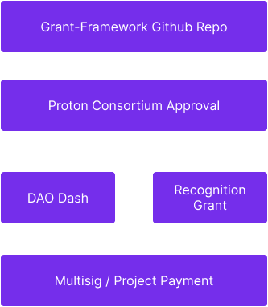

# XPR Network Development Fund
## Overview

The XPR Grants Program is funded by the Community Warchest from the XPR  NetworkDevelopment Fund.

In order to apply for a grant you must meet certain criteria and make your submission. Then you may create a DAO Dash Proposal where the community will vote. Depending on the results of the DAO Dash, the proposal will be approved by the XPR Consortium.

When you create your proposal using [XPR GOV Dashboard](https://gov.xprnetwork.org)
gov.XPRNetwork.org make sure to link to your grant application and be clear to the community about how much USD / XPR you are asking for and be clear how many milestones the proposal is for.

There are also Recognition Grants that may be awarded to proven projects at the discretion of the XPR Consortium.

## Grant Guidelines

Individuals and companies are allowed to apply for grants. The purpose of these grants is to help developers and small businesses build on the XPR Network. All types of projects are allowed to submit an application, but open source projects are preferred as you will see below. All applications must meet the following minimum requirements.

<table width="100%">
  <tr><th>&nbsp;</th><th>Individual</th><th>Small Team</th><th>Company</th></tr>
  <tr><td><b>Amount</b></td><td align="center">Up to $1,000</td><td align="center">Up to $5,000</td><td align="center">Up to $10,000</td></tr>
  <tr><td><b>Open Source</b></td><td align="center">Up to $5,000</td><td align="center">Up to $25,000</td><td align="center">Up to $50,000</td></tr>
  <tr>
    <td valign="top"><b>Requirements</b></td>
    <td valign="top"><ul><li>Must have an XPR Network account</li><li>XPR Network account must have KYC verification</li><li>Must have proven experience</li></ul></td>
    <td valign="top"><ul><li>Must have an XPR Network account</li><li>XPR Network account must have KYC verification</li><li>Must have live project or can show experienced team</li><li>Must have live call with a Consortium member
</li></ul></td>
    <td valign="top"><ul><li>Must have an XPR Network account</li><li>XPR Network account must have KYC verification</li><li>Must have live project or can show experienced team</li><li>In person (if feasible) or virtual meeting with someone from Metallicus or Consortium</li></ul></td>
  </tr>
</table>

Special **Company** Grants may be considered for essential services and critical infrastructure that is used by the community and network.

Grant milestones will be monitored by the XPR Consortium and Core Developers.

## Application Process

1. Fork this repo 
2. Go to the `applications` folder
3. Add File `your_project.md` 
4. Make a copy of contents from [(applications/application-template.md)](applications/application-template.md) 
5. Paste the contents into your new file
6. Fill out the template with the details of your own project 
7. When you're done, commit the changes **directly to the `master` branch**
8. Create a Pull Request for `your_project.md` file

## Application Process

After a grant is submitted, the XPR Consortium will decide if it meets the criteria to create a DAO Dash Proposal unless it is a Recognition or Special Company Grant in which case it may be approved internally by the Consortium. 

The XPR Consortium may seek out clarifications and you may address any feedback in writing. If we don’t receive a reply within 2 weeks the application will be closed. You may resubmit your proposal.

Once the XPR Consortium agrees that the minimum criteria are met and terms and conditions have been signed, the Consortium will create the DAO Dash Proposal and the community will then have an opportunity to vote. 

If the vote passes via DAO Dash then the XPR Consortium will create the msig for the first milestone and payment will be approved by 3 members of the Consortium.

## Milestone Process

Projects Milestones should be reported to the community via github and will be monitored by the XPR Consortium. Failure to disclose progress and deliverables will result in delayed payment for future milestones.

## Payments

Payments are made in XPR at the time of the milestone sign off by the XPR Consortium and the proposal msig is approved by 3 Consortium members. For first time grant recipients the payment will be made on a per milestone basis.

## Application Process

Your Proposal should present a well researched or tested idea for which you can show some prior work. You should demonstrate that the project will be maintained after it has been deployed and show a clear commitment to the technology from you and your team. 

You should show that your team has proven experience with XPR Network WebSDK or Antelope blockchain technology or a very strong technical background. It is recommended that you provide the GitHub profiles of your team members as part of your application. You can link to projects on other platforms. It is recommended that you have some presence in the XPR Network community and clearly present how your project will be beneficial to the ecosystem.

This document is subject to change please check the latest version here on Github.

## Grant Evaluators

- [XPR Consortium Members](https://xprnetwork.org/governance)
- [Metallicus Core Developers](https://github.com/metallicusdev)

## Grant Operator

- [Paul Grey](https://github.com/paulgnz)

